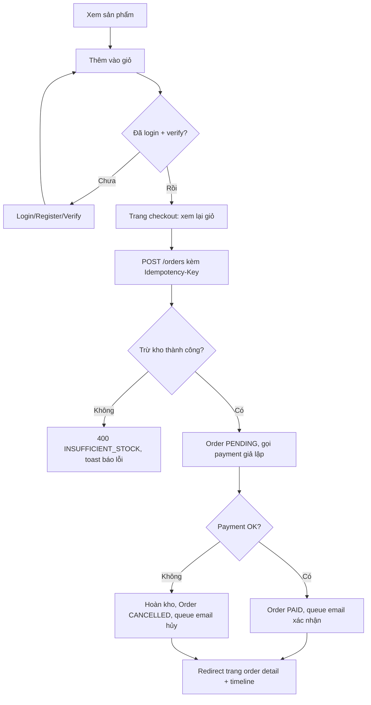
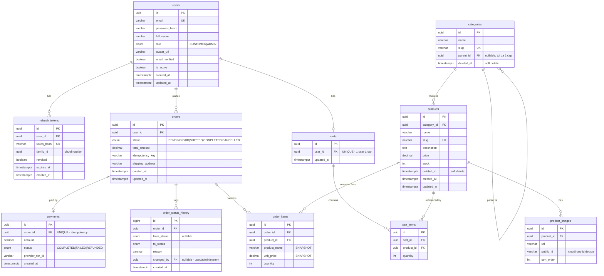
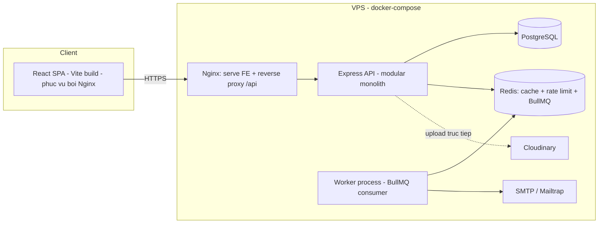
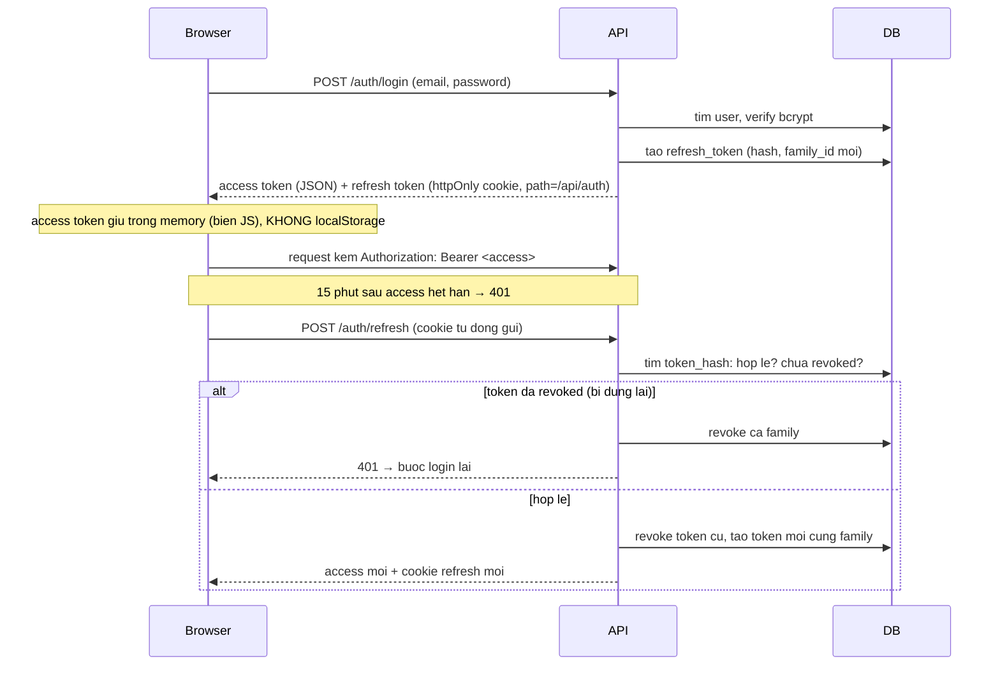
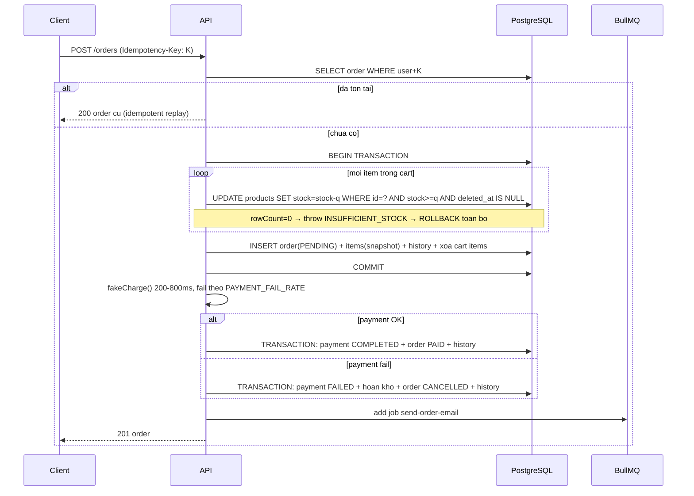

# HANDBOOK: XÂY DỰNG DỰ ÁN FULL STACK CÁ NHÂN — MINI E-COMMERCE "SHOPLITE"

> Tài liệu hướng dẫn phát triển một dự án Full Stack hoàn chỉnh từ đầu đến cuối, dành cho mục đích học tập cá nhân. Viết theo nguyên tắc: **giải thích "Tại sao" trước khi hướng dẫn "Làm như thế nào"**.

---

## 0. PHÂN TÍCH TÀI LIỆU THAM KHẢO — ĐỌC TRƯỚC KHI BẮT ĐẦU

### 0.1. Tài liệu tham khảo thực chất là gì

Tài liệu `capstone-project/README.md` **là một spec dự án backend microservices cụ thể**, không phải danh sách kỹ năng Full Stack tổng quát. Nội dung của nó:

- Hệ thống xử lý đơn hàng e-commerce gồm 5 services: API Gateway, order-service, inventory-service, payment-service, notification-service.
- Stack: Node.js 20 + TypeScript, Express/Fastify, PostgreSQL, MongoDB, Redis, Kafka, Docker, Kubernetes, AWS (EKS/RDS/MSK).
- Trọng tâm là các pattern hệ phân tán: Outbox, Saga choreography, Idempotent consumer, Idempotency key, Cache-aside, Distributed lock, DLQ, Graceful shutdown, Health check, Rate limiting.
- Hoàn toàn **không có frontend**.

### 0.2. Bảng quyết định: giữ gì, bỏ gì, thay bằng gì

Nguyên tắc: **giữ lại tư duy và pattern, bỏ hạ tầng phân tán**. Một dự án cá nhân mà mất 80% thời gian cho Kafka + K8s là dự án thất bại về mặt học tập Full Stack.

| Công nghệ / Pattern trong tài liệu | Quyết định | Lý do & cách thay thế |
|---|---|---|
| Node.js 20 + TypeScript | ✅ Giữ nguyên | Nền tảng của cả dự án |
| Express | ✅ Giữ nguyên | Phổ biến nhất, tài liệu nhiều nhất |
| PostgreSQL | ✅ Giữ nguyên | DB chính duy nhất |
| Redis | ✅ Giữ nguyên | Cache + rate limit + queue backend |
| Validation `zod` | ✅ Giữ nguyên | Dùng chung schema cho cả backend & frontend |
| Logging `pino` + correlation ID | ✅ Giữ nguyên | Structured logging là kỹ năng bắt buộc |
| Idempotency key cho POST /orders | ✅ Giữ nguyên | Pattern quan trọng, triển khai được trong monolith |
| Chống oversell (conditional update) | ✅ Giữ nguyên | Bài học "đắt" nhất của tài liệu gốc, chuyển sang dạng `UPDATE ... WHERE stock >= qty` + DB transaction |
| Cache-aside + invalidate bằng DELETE | ✅ Giữ nguyên | Áp dụng cho product catalog |
| Rate limiting (token bucket / Redis) | ✅ Giữ nguyên | Middleware ở monolith thay vì gateway |
| Health check `/health`, `/health/ready` | ✅ Giữ nguyên | Cần cho Docker healthcheck & deploy |
| Graceful shutdown (SIGTERM) | ✅ Giữ nguyên | Đóng HTTP server, DB pool, queue worker |
| Docker multi-stage + docker-compose | ✅ Giữ nguyên | Chuẩn triển khai của dự án |
| Retry + backoff + "DLQ" | 🔄 Thay thế | Dùng **BullMQ** (queue trên Redis) cho job nền (gửi email, notification). BullMQ có sẵn retry/backoff/failed queue — học được đúng tư duy DLQ mà không cần Kafka |
| Kafka + Outbox + Saga choreography | ❌ Bỏ | Đây là giải pháp cho **distributed transaction giữa nhiều service**. Monolith dùng **DB transaction** là đủ và đúng. Handbook có mục giải thích khi nào mới cần saga/outbox (mục 16) |
| Microservices (5 services) | ❌ Bỏ | Thay bằng **modular monolith**: 1 codebase, chia module rõ ràng theo domain. Nếu sau này cần tách service, ranh giới module chính là ranh giới service |
| MongoDB | ❌ Bỏ | Tài liệu gốc dùng Mongo chỉ để minh họa polyglot persistence. Dự án cá nhân dùng 2 loại DB là tự làm khổ mình. PostgreSQL + JSONB phủ được mọi nhu cầu |
| Kubernetes (kind/minikube, HPA, probes) | ❌ Bỏ | K8s để giải bài toán vận hành hàng chục service/pod. 1 monolith + docker-compose trên VPS là đủ. Tư duy probes/graceful shutdown vẫn được học qua Docker healthcheck |
| AWS EKS/MSK/ElastiCache | ❌ Bỏ | Chi phí + độ phức tạp không phục vụ mục tiêu học Full Stack. Deploy VPS bằng docker-compose + Nginx (mục 15) |
| Distributed lock (Redis SET NX) | ⚠️ Không dùng làm lớp chính | Trong monolith + 1 DB, `SELECT ... FOR UPDATE` hoặc conditional update là đúng công cụ. Handbook vẫn giải thích distributed lock ở mục 16 để hiểu vì sao tài liệu gốc cần nó |
| Prometheus/Grafana/OpenTelemetry | ⚠️ Để phần mở rộng | Quá tay cho dự án cá nhân, nhưng ghi lại làm "next steps" |
| k6 load test | ⚠️ Tùy chọn | Dùng 1 script nhỏ để test chống oversell (50 request đồng thời) — giữ được bài test giá trị nhất của tài liệu gốc |

### 0.3. Phần tài liệu gốc KHÔNG có nhưng Full Stack bắt buộc phải có

Tài liệu gốc thuần backend. Handbook này bổ sung toàn bộ phần còn thiếu:

- **Frontend**: React + Vite + TypeScript, React Router, TanStack Query, react-hook-form, Tailwind CSS, Recharts.
- **Authentication đầy đủ**: register, verify email, login, refresh token rotation, forgot/reset password, change password (tài liệu gốc chỉ có "verify JWT ở gateway, token cấp bằng script seed").
- **Authorization**: role-based (CUSTOMER / ADMIN).
- **Upload ảnh**: Cloudinary.
- **Dashboard**: thống kê + biểu đồ.
- **Email**: Nodemailer + Mailtrap (dev) / Resend hoặc SMTP thật (production).
- **API Documentation**: Swagger/OpenAPI.
- **Git workflow, README, deployment lên VPS.**

---

## 1. GIỚI THIỆU DỰ ÁN

### 1.1. Dự án được chọn: **ShopLite — Mini E-commerce**

Một cửa hàng trực tuyến thu nhỏ: khách xem catalog sản phẩm, thêm vào giỏ, đặt hàng, thanh toán (giả lập), nhận email xác nhận; admin quản lý sản phẩm, đơn hàng, xem dashboard doanh thu.

### 1.2. Vì sao chọn E-commerce mà không phải CRM / LMS / Booking

Tiêu chí chọn là **mật độ kiến thức trên một tính năng**, không phải độ dễ:

1. **Trùng domain với tài liệu tham khảo** → tái sử dụng tối đa: bài toán chống oversell, idempotency key, trạng thái đơn hàng, cache catalog, notification — tất cả đều chuyển thẳng từ tài liệu gốc sang được.
2. **Có bài toán concurrency thật**: 2 người mua cùng lúc sản phẩm còn 1 chiếc. CRM/LMS gần như thuần CRUD, không có tình huống tranh chấp dữ liệu nào đáng học.
3. **Có bài toán transaction thật**: tạo order = trừ kho + ghi order + ghi order_items + ghi payment — tất cả phải cùng thành công hoặc cùng thất bại. Đây là nơi duy nhất người học *bắt buộc* hiểu transaction, không né được.
4. **Có state machine thật**: `PENDING → PAID → SHIPPED → COMPLETED / CANCELLED` — học cách quản lý trạng thái và ràng buộc chuyển trạng thái.
5. **Dashboard có ý nghĩa**: doanh thu theo ngày, top sản phẩm — số liệu tự sinh ra từ chính việc dùng app, không phải số liệu bịa.
6. **Phủ toàn bộ module yêu cầu**: auth, role, profile, upload, CRUD nhiều tầng (category → product → order), search/filter/sort/pagination, cache, email, toast.

### 1.3. Đối tượng sử dụng

- **Guest**: xem sản phẩm, tìm kiếm, xem chi tiết.
- **Customer** (đã đăng ký): giỏ hàng, đặt hàng, xem lịch sử đơn, quản lý profile.
- **Admin**: CRUD sản phẩm/danh mục, quản lý đơn hàng (đổi trạng thái), quản lý user, xem dashboard.

### 1.4. Chức năng chính

| Nhóm | Chức năng |
|---|---|
| Auth | Register, Verify Email, Login, Logout, Refresh Token, Forgot/Reset Password, Change Password |
| Catalog | Danh mục, sản phẩm, ảnh sản phẩm, search/filter/sort/pagination, cache Redis |
| Cart | Giỏ hàng server-side cho user đã đăng nhập |
| Order | Đặt hàng (idempotent, transaction, chống oversell), timeline trạng thái, hủy đơn |
| Payment | Giả lập cổng thanh toán (delay + fail ngẫu nhiên) để học xử lý lỗi |
| Notification | Toast (frontend) + Email qua queue (BullMQ) với retry |
| Admin | CRUD + soft delete, quản lý đơn, quản lý user |
| Dashboard | Doanh thu theo ngày, top sản phẩm, đơn theo trạng thái |

### 1.5. Tech Stack (chốt)

| Tầng | Công nghệ | Vì sao |
|---|---|---|
| Ngôn ngữ | TypeScript (cả FE & BE) | Type safety xuyên suốt; chia sẻ type giữa 2 đầu |
| Backend | Node.js 20 + Express 4 | Theo tài liệu gốc; hệ sinh thái lớn nhất |
| ORM | Prisma | Migration + seed + type-safe query tích hợp sẵn — đúng nhu cầu học. Nhược điểm: che mất SQL; handbook sẽ chỉ ra chỗ nào phải viết raw SQL (`$queryRaw`) để không mù SQL |
| Database | PostgreSQL 16 | Theo tài liệu gốc |
| Cache/Queue | Redis 7 + BullMQ | Cache-aside, rate limit, job nền |
| Auth | JWT (access) + Refresh token rotation (httpOnly cookie) | Chuẩn phổ biến, học được cả cookie security |
| Validation | Zod | Dùng chung schema FE/BE |
| Logging | Pino + pino-http | Structured log + request ID |
| Email | Nodemailer + Mailtrap (dev) | Miễn phí, xem được email test |
| Upload | Cloudinary | Free tier đủ dùng, có transform ảnh |
| Frontend | React 18 + Vite + TypeScript | Chuẩn thị trường hiện tại |
| Data fetching | TanStack Query v5 | Server state: cache, retry, invalidation — đúng bài học cache ở phía client |
| Form | react-hook-form + zod resolver | Tái dùng schema validation |
| Styling | Tailwind CSS | Nhanh, không phải học thêm design system |
| Chart | Recharts | Đơn giản, đủ cho dashboard |
| API Docs | Swagger UI (OpenAPI 3, sinh từ zod bằng `zod-to-openapi`) | Docs không lệch code |
| Testing | Vitest + Supertest | Vitest nhanh, cùng config với Vite phía FE |
| DevOps | Docker multi-stage, docker-compose, Nginx, GitHub Actions | Theo tài liệu gốc, bỏ K8s |

### 1.6. Kiến thức sẽ học được (checklist tự đánh giá)

- [ ] Phân tích nghiệp vụ → thiết kế DB → API contract → code (đúng trình tự, không code trước nghĩ sau)
- [ ] Thiết kế ERD, migration, seed, index, quan hệ, transaction
- [ ] Authentication đầy đủ vòng đời token; hiểu vì sao refresh token phải rotate
- [ ] Authorization theo role, middleware chain
- [ ] Xử lý concurrency: chống oversell bằng conditional update + transaction
- [ ] Idempotency key: vì sao POST cần nó, triển khai thế nào
- [ ] Cache-aside + cache invalidation (bài toán khó nhất của caching)
- [ ] Job nền với queue: retry, backoff, failed jobs
- [ ] Error handling tập trung, error code có cấu trúc
- [ ] Structured logging + correlation ID
- [ ] Frontend: server state vs client state, form validation, protected routes, optimistic update
- [ ] Docker hóa toàn bộ, CI với GitHub Actions, deploy VPS với Nginx + HTTPS

---

## 2. PHÂN TÍCH NGHIỆP VỤ

### 2.1. Functional Requirements

**FR-AUTH**
- FR-A1: User đăng ký bằng email + password; nhận email chứa link verify (token hết hạn 24h).
- FR-A2: Chỉ user đã verify mới đặt hàng được (xem sản phẩm thì không cần).
- FR-A3: Login trả về access token (15 phút) + refresh token (7 ngày, httpOnly cookie).
- FR-A4: Refresh token dùng 1 lần (rotation); dùng lại token cũ → thu hồi cả chuỗi (phát hiện token bị đánh cắp).
- FR-A5: Forgot password gửi email chứa token reset (hết hạn 1h, dùng 1 lần).
- FR-A6: Change password yêu cầu password hiện tại; đổi xong thu hồi mọi refresh token.

**FR-CATALOG**
- FR-C1: Guest xem danh sách sản phẩm: search theo tên, filter theo category + khoảng giá, sort theo giá/ngày tạo, pagination.
- FR-C2: Chi tiết sản phẩm gồm nhiều ảnh, mô tả, tồn kho hiển thị dạng "còn hàng / sắp hết (<5) / hết hàng".
- FR-C3: Admin CRUD category (2 cấp tối đa) và product; product bị soft delete vẫn hiển thị trong đơn hàng cũ.

**FR-CART**
- FR-CT1: Cart gắn với user, lưu server-side; cộng dồn quantity khi thêm trùng sản phẩm.
- FR-CT2: Quantity không vượt tồn kho tại thời điểm thêm (chỉ là kiểm tra mềm — kiểm tra cứng nằm ở lúc đặt hàng).

**FR-ORDER**
- FR-O1: Đặt hàng từ cart; request bắt buộc có header `Idempotency-Key`; retry cùng key → trả lại order cũ, không tạo trùng.
- FR-O2: Đặt hàng phải trừ kho nguyên tử: **tuyệt đối không oversell** kể cả khi nhiều request đồng thời.
- FR-O3: Giá chốt tại thời điểm đặt (snapshot `unit_price` vào order_items — giá sản phẩm đổi sau đó không ảnh hưởng đơn cũ).
- FR-O4: Thanh toán giả lập (delay 200–800ms, fail ~20% theo env `PAYMENT_FAIL_RATE`); fail → hoàn kho + đơn CANCELLED.
- FR-O5: Mọi thay đổi trạng thái ghi vào `order_status_history` (timeline).
- FR-O6: Customer hủy đơn được khi còn PENDING/PAID (chưa SHIPPED) → hoàn kho.
- FR-O7: Admin chuyển trạng thái theo đúng state machine, không nhảy cóc.

**FR-NOTIFY**
- FR-N1: Email xác nhận/hủy đơn gửi qua queue, retry 3 lần backoff, quá 3 lần → nằm ở failed queue để xem lại.
- FR-N2: Frontend hiện toast cho mọi hành động thành công/thất bại.

**FR-ADMIN & DASHBOARD**
- FR-D1: Dashboard: doanh thu 30 ngày (line chart), đơn theo trạng thái (số liệu), top 5 sản phẩm bán chạy (bar chart), tổng user/product/order.
- FR-D2: Admin quản lý user: xem danh sách, khóa/mở tài khoản. Không xóa user (giữ toàn vẹn dữ liệu đơn hàng).

### 2.2. Non-functional Requirements

| NFR | Yêu cầu | Cách đạt |
|---|---|---|
| Consistency | Kho + đơn hàng đúng tuyệt đối | DB transaction + conditional update |
| Security | Theo OWASP cơ bản | Mục 10 |
| Performance | Danh sách sản phẩm p95 < 100ms khi cache hit | Redis cache-aside, index DB |
| Observability | Trace được 1 request xuyên hệ thống | Request ID trong mọi log |
| Resilience | Job email fail không mất | BullMQ retry + failed queue |
| Maintainability | Người khác đọc hiểu trong 1 ngày | Cấu trúc module theo domain, README, Swagger |

### 2.3. User Flow chính (đặt hàng)



### 2.4. Business Rules (chốt cứng, code phải tuân theo)

- BR1: State machine đơn hàng — chỉ cho phép: `PENDING→PAID`, `PENDING→CANCELLED`, `PAID→SHIPPED`, `PAID→CANCELLED`, `SHIPPED→COMPLETED`. Mọi chuyển khác → 409.
- BR2: Hoàn kho chỉ xảy ra khi CANCELLED từ PENDING/PAID. Đơn SHIPPED không hủy được qua hệ thống (xử lý ngoài luồng — ghi rõ trong docs, không code).
- BR3: `total_amount` = tổng `unit_price × quantity` của order_items, tính ở server, **không bao giờ nhận từ client**.
- BR4: Email chưa verify → được login, được xem, **không được đặt hàng** (403 EMAIL_NOT_VERIFIED).
- BR5: Soft delete product → biến mất khỏi catalog & cart, nhưng order_items cũ vẫn tham chiếu được (vì snapshot tên + giá).
- BR6: Idempotency-Key unique theo user; key trùng của user khác không đụng nhau.

### 2.5. Use Case tóm tắt

| Use case | Actor | Precondition | Main flow | Alternate |
|---|---|---|---|---|
| UC1 Đặt hàng | Customer | Đã login, verified, cart không rỗng | Checkout → tạo order → thanh toán → email | Hết kho: báo lỗi từng item; Payment fail: đơn CANCELLED |
| UC2 Hủy đơn | Customer | Đơn PENDING/PAID của chính mình | Bấm hủy → hoàn kho → email | Đơn đã SHIPPED: 409 |
| UC3 Quản lý sản phẩm | Admin | Login role ADMIN | CRUD + upload ảnh → invalidate cache | Xóa: soft delete |
| UC4 Đổi trạng thái đơn | Admin | — | Chuyển theo state machine, ghi history | Chuyển sai: 409 |

---

## 3. THIẾT KẾ DATABASE

### 3.1. Nguyên tắc thiết kế (đọc trước khi nhìn ERD)

1. **Snapshot dữ liệu giao dịch**: đơn hàng là *bằng chứng lịch sử*. `order_items` lưu `product_name` và `unit_price` tại thời điểm mua — không JOIN sang bảng products để lấy giá hiện tại. Đây là lỗi thiết kế phổ biến nhất của người mới.
2. **Soft delete có chọn lọc**: chỉ soft delete thứ được tham chiếu bởi dữ liệu giao dịch (products, categories). User không xóa mà chỉ khóa (`is_active`). Cart items xóa cứng — không có giá trị lịch sử.
3. **Tiền dùng `DECIMAL(12,2)`**, tuyệt đối không `FLOAT` (sai số nhị phân). Với VNĐ có thể dùng `DECIMAL(12,0)`, handbook giữ 12,2 cho tổng quát.
4. **Trạng thái là ENUM ở tầng DB** — DB tự chặn giá trị rác, không chỉ trông cậy vào code.
5. **Index đi theo query, không index bừa**: mỗi index ghi rõ phục vụ query nào (mục 3.5).

### 3.2. ERD



Bảng phụ không vẽ trong ERD: `email_tokens (id, user_id, token_hash, type: VERIFY|RESET, expires_at, used_at)` — dùng chung cho verify email và reset password.

### 3.3. Giải thích các quyết định thiết kế đáng chú ý

| Quyết định | Lý do |
|---|---|
| `refresh_tokens.family_id` | Phát hiện token bị đánh cắp: mỗi lần login tạo 1 family; mỗi lần refresh, token cũ bị đánh dấu revoked và token mới cùng family sinh ra. Nếu một token **đã revoked** được dùng lại → kẻ gian đang giữ token cũ → revoke cả family, buộc login lại. |
| Lưu `token_hash` chứ không lưu token | DB bị lộ thì token vẫn vô dụng — cùng nguyên tắc với password. |
| `orders.idempotency_key` + UNIQUE `(user_id, idempotency_key)` | Ràng buộc idempotency được **DB bảo vệ**, không chỉ code. Race condition 2 request cùng key cùng lúc → 1 cái thắng, 1 cái vướng unique violation → bắt lỗi và trả order đã tạo. |
| `payments.order_id UNIQUE` | Không bao giờ charge 2 lần cho 1 đơn — idempotency ở tầng schema (học từ tài liệu gốc). |
| `order_status_history.from_status` nullable | Bản ghi đầu tiên (tạo đơn) không có trạng thái trước. |
| Category tự tham chiếu `parent_id`, giới hạn 2 cấp bằng code | Đủ dùng thực tế; cây vô hạn cấp cần recursive CTE — không đáng độ phức tạp cho dự án này. |

### 3.4. Prisma schema (trích các phần quan trọng)

```prisma
// prisma/schema.prisma
enum OrderStatus { PENDING PAID SHIPPED COMPLETED CANCELLED }
enum Role { CUSTOMER ADMIN }

model Product {
  id          String    @id @default(uuid()) @db.Uuid
  categoryId  String    @map("category_id") @db.Uuid
  name        String
  slug        String    @unique
  description String?
  price       Decimal   @db.Decimal(12, 2)
  stock       Int       @default(0)
  deletedAt   DateTime? @map("deleted_at")
  createdAt   DateTime  @default(now()) @map("created_at")
  updatedAt   DateTime  @updatedAt @map("updated_at")
  category    Category  @relation(fields: [categoryId], references: [id])
  images      ProductImage[]

  @@index([categoryId, deletedAt])          // filter theo category
  @@index([deletedAt, createdAt(sort: Desc)]) // list moi nhat
  @@index([deletedAt, price])               // sort/filter theo gia
  @@map("products")
}

model Order {
  id             String      @id @default(uuid()) @db.Uuid
  userId         String      @map("user_id") @db.Uuid
  status         OrderStatus @default(PENDING)
  totalAmount    Decimal     @map("total_amount") @db.Decimal(12, 2)
  idempotencyKey String      @map("idempotency_key")
  // ...
  @@unique([userId, idempotencyKey])
  @@index([userId, createdAt(sort: Desc)])   // lich su don cua user
  @@index([status, createdAt])               // admin filter theo trang thai
  @@map("orders")
}
```

### 3.5. Index — mỗi index phục vụ query nào

| Index | Query phục vụ |
|---|---|
| `products(deleted_at, created_at DESC)` | List catalog mặc định "mới nhất", điều kiện `deleted_at IS NULL` luôn có mặt |
| `products(category_id, deleted_at)` | Filter theo category |
| `products(deleted_at, price)` | Sort theo giá + filter khoảng giá |
| `orders(user_id, created_at DESC)` | "Đơn hàng của tôi" |
| `orders(status, created_at)` | Admin lọc đơn theo trạng thái |
| `refresh_tokens(token_hash)` UNIQUE | Lookup mỗi lần refresh |
| Search tên sản phẩm | Bước 1 dùng `ILIKE '%q%'` (chấp nhận seq scan ở quy mô nhỏ); ghi chú nâng cấp: `pg_trgm` GIN index khi dữ liệu lớn — ví dụ điển hình của "đừng tối ưu sớm nhưng phải biết đường nâng cấp" |

### 3.6. Migration & Seed

- Migration: `npx prisma migrate dev --name init` — mỗi thay đổi schema là một migration mới, **không sửa migration cũ đã chạy**. Đây là kỷ luật quan trọng nhất khi làm việc nhóm sau này.
- Seed (`prisma/seed.ts`): 1 admin (`admin@shoplite.dev`), 3 customer đã verify, 5 categories (2 cấp), 30 products có ảnh placeholder, vài đơn hàng mẫu rải trong 30 ngày để dashboard có dữ liệu. Chạy: `npx prisma db seed`.
- Quy tắc seed: **idempotent** — chạy lại không nhân đôi dữ liệu (dùng `upsert` theo slug/email).

---

## 4. KIẾN TRÚC HỆ THỐNG

### 4.1. Tổng thể



Điểm cần hiểu: **API và Worker là 2 process chạy từ cùng 1 codebase** (`npm run start:api` / `npm run start:worker`). Tách process để job email chậm/fail không ảnh hưởng latency của HTTP request — đây chính là tinh thần của notification-service trong tài liệu gốc, thu nhỏ về mức monolith.

### 4.2. Backend Architecture — Modular Monolith, 3 lớp

```
Request → Middleware chain → Router → Controller → Service → Repository (Prisma) → DB
                                          ↓
                                    Queue producer (BullMQ) → Redis → Worker
```

- **Controller**: đọc request đã validate, gọi service, format response. KHÔNG chứa business logic.
- **Service**: toàn bộ business logic, transaction, gọi queue. KHÔNG biết gì về HTTP (không đụng req/res).
- **Repository**: truy cập dữ liệu. Với Prisma, lớp này mỏng — chấp nhận service gọi Prisma trực tiếp ở module đơn giản, nhưng module Order có logic query phức tạp thì tách repository rõ.
- Vì sao 3 lớp mà không Clean Architecture đầy đủ (use-case, entity, port/adapter)? — Clean Architecture đúng nghĩa cần lượng boilerplate lớn; với dự án cá nhân, chi phí đọc-hiểu vượt lợi ích. 3 lớp là điểm cân bằng phổ biến nhất trong các codebase Node thực tế.

### 4.3. Authentication Flow



### 4.4. Authorization Flow

Middleware chain: `authenticate` (giải mã JWT, gắn `req.user`) → `requireVerified` (chặn email chưa verify ở route đặt hàng) → `requireRole('ADMIN')` (route admin). Mỗi middleware một trách nhiệm, ghép theo nhu cầu từng route.

### 4.5. Order Flow (trái tim của dự án)



Hai điểm phải hiểu sâu:
1. **Chống oversell nằm ở `WHERE stock >= quantity`** — DB thực hiện check-and-update nguyên tử trên từng row. 50 request đồng thời mua sản phẩm còn 5 → đúng 5 thành công. Không cần Redis lock vì chỉ có 1 DB (khác tài liệu gốc: họ cần lock vì MongoDB thời điểm đó + nhiều instance service).
2. **Payment nằm NGOÀI transaction trừ kho** — không giữ transaction DB mở trong lúc chờ I/O 800ms (chiếm connection, khóa row). Hệ quả: có khoảng thời gian đơn PENDING đã trừ kho; nếu process chết ngay lúc đó → đơn kẹt PENDING. Xử lý: một job định kỳ (BullMQ repeatable, 10 phút/lần) quét đơn PENDING quá 15 phút → hoàn kho + CANCELLED. Đây là phiên bản đơn giản của "saga recovery" trong tài liệu gốc — cùng vấn đề, lời giải nhỏ hơn.

### 4.6. Upload Flow

Client chọn ảnh → gửi `multipart/form-data` lên API → API (multer, memory storage, giới hạn 5MB, whitelist mimetype) → stream lên Cloudinary → lưu `url + public_id` vào DB. Xóa ảnh: xóa Cloudinary bằng `public_id` trước, xóa DB sau (nếu Cloudinary fail thì DB chưa mất tham chiếu). Không cho client upload thẳng lên Cloudinary bằng unsigned preset — mất kiểm soát và lộ cấu hình; signed upload trực tiếp là bước tối ưu sau này.

### 4.7. Redis Flow

| Vai trò | Key | TTL | Ghi chú |
|---|---|---|---|
| Cache list sản phẩm | `products:list:<hash(query params)>` | 60s | TTL ngắn vì có nhiều biến thể query |
| Cache chi tiết | `products:detail:<id>` | 5 phút | Invalidate chủ động |
| Rate limit | `rl:<ip>` hoặc `rl:user:<id>` | cửa sổ 1 phút | Chi tiết mục 10 |
| BullMQ | `bull:email:*` | — | Queue tự quản lý |
| Dashboard stats | `dashboard:stats` | 5 phút | Query nặng, chấp nhận trễ 5 phút |

Invalidation: mọi write vào product (create/update/delete/trừ kho khi đặt hàng... **trừ** việc trừ kho — xem ghi chú) → `DEL products:detail:<id>` + xóa toàn bộ `products:list:*` (dùng một `SCAN` + `DEL`, hoặc gọn hơn: version key — mục 8). Ghi chú về trừ kho: nếu invalidate cache mỗi lần đặt hàng thì cache list gần như vô dụng lúc cao điểm; chấp nhận tồn kho hiển thị trễ tối đa 60s, vì nguồn chân lý khi đặt hàng là DB chứ không phải cache — đây là quyết định trade-off điển hình cần giải thích được.

### 4.8. Deployment Flow

Dev: `docker compose up` (postgres, redis, mailtrap không cần — dùng cloud) + `npm run dev` 2 đầu. Production: GitHub Actions build image → push registry → SSH vào VPS → `docker compose pull && up -d`. Chi tiết mục 9 và 15.


---

## 5. CẤU TRÚC THƯ MỤC

Monorepo 2 workspace — đủ gọn cho dự án cá nhân, không cần Turborepo/Nx:

```
shoplite/
├── docker-compose.yml          # postgres + redis cho dev
├── docker-compose.prod.yml     # full stack cho production
├── .github/workflows/ci.yml
├── server/
│   ├── prisma/
│   │   ├── schema.prisma
│   │   ├── migrations/
│   │   └── seed.ts
│   ├── src/
│   │   ├── index.ts            # entry API: tao app, listen, graceful shutdown
│   │   ├── worker.ts           # entry Worker: BullMQ consumers
│   │   ├── app.ts              # lap rap Express app (de test duoc bang Supertest)
│   │   ├── config/
│   │   │   └── env.ts          # doc + VALIDATE env bang zod, fail-fast khi thieu
│   │   ├── lib/                # ket noi ha tang: prisma.ts, redis.ts, logger.ts,
│   │   │                       # queue.ts, mailer.ts, cloudinary.ts
│   │   ├── middlewares/        # authenticate, requireRole, requireVerified,
│   │   │                       # validate(zodSchema), rateLimit, errorHandler,
│   │   │                       # requestId, notFound
│   │   ├── shared/
│   │   │   ├── errors.ts       # AppError + danh muc error code
│   │   │   ├── response.ts     # dinh dang response chuan
│   │   │   └── pagination.ts
│   │   └── modules/            # ⭐ chia theo DOMAIN, khong chia theo loai file
│   │       ├── auth/
│   │       │   ├── auth.routes.ts
│   │       │   ├── auth.controller.ts
│   │       │   ├── auth.service.ts
│   │       │   ├── auth.schemas.ts      # zod
│   │       │   ├── token.service.ts     # JWT + refresh rotation
│   │       │   └── auth.test.ts
│   │       ├── users/
│   │       ├── categories/
│   │       ├── products/
│   │       ├── cart/
│   │       ├── orders/
│   │       │   ├── ... + order.state.ts # state machine
│   │       │   └── payment.service.ts   # fake gateway
│   │       ├── uploads/
│   │       ├── dashboard/
│   │       └── emails/          # templates + queue producer/consumer
│   └── Dockerfile
├── client/
│   ├── src/
│   │   ├── main.tsx, App.tsx, router.tsx
│   │   ├── api/                # axios instance + interceptor refresh token
│   │   ├── features/           # ⭐ cung tu duy chia theo domain
│   │   │   ├── auth/           # pages, components, hooks (useLogin...), store
│   │   │   ├── products/
│   │   │   ├── cart/
│   │   │   ├── orders/
│   │   │   └── admin/          # products-admin, orders-admin, users-admin, dashboard
│   │   ├── components/ui/      # Button, Input, Modal, Toast, Table, Pagination...
│   │   ├── layouts/            # MainLayout, AdminLayout, AuthLayout
│   │   ├── hooks/              # useDebounce, useQueryParams
│   │   └── lib/                # queryClient, utils, constants
│   └── Dockerfile              # build → copy vao nginx image
└── README.md
```

**Vì sao chia theo domain (module) thay vì theo loại file (controllers/, services/, models/)?** Khi sửa tính năng Order, mọi file liên quan nằm cạnh nhau; xóa 1 tính năng = xóa 1 thư mục; và ranh giới module hôm nay chính là ranh giới microservice ngày mai nếu cần tách. Chia theo loại file chỉ tiện khi dự án < 10 file.

---

## 6. HƯỚNG DẪN XÂY DỰNG BACKEND

> Trình tự xây dựng đúng của dự án thật: **nền móng → auth → catalog → cart → order → phần còn lại**. Mỗi module dưới đây trình bày theo khung: Mục tiêu / Vì sao / Kiến thức / API / Logic chính / Lưu ý.

### 6.0. Module 0 — Nền móng (làm TRƯỚC mọi tính năng)

Mục tiêu: có bộ khung mà mọi module sau chỉ việc "cắm vào". Người mới hay bỏ qua bước này rồi trả giá bằng việc refactor toàn bộ.

**a) Validate env fail-fast** — app thiếu config phải chết ngay lúc khởi động, không chết lúc 2h sáng khi request đầu tiên đụng tới:

```ts
// src/config/env.ts
import { z } from 'zod';
const envSchema = z.object({
  NODE_ENV: z.enum(['development', 'test', 'production']).default('development'),
  PORT: z.coerce.number().default(3000),
  DATABASE_URL: z.string().url(),
  REDIS_URL: z.string().url(),
  JWT_ACCESS_SECRET: z.string().min(32),
  JWT_REFRESH_SECRET: z.string().min(32),
  CLOUDINARY_URL: z.string(),
  SMTP_URL: z.string(),
  CLIENT_URL: z.string().url(),
  PAYMENT_FAIL_RATE: z.coerce.number().min(0).max(1).default(0.2),
});
export const env = envSchema.parse(process.env); // throw → process chet → dung y do
```

**b) Error handling tập trung** — mọi lỗi đi qua đúng 1 cửa:

```ts
// src/shared/errors.ts
export class AppError extends Error {
  constructor(
    public statusCode: number,
    public code: string,        // may doc: 'INSUFFICIENT_STOCK'
    message: string,            // nguoi doc
    public details?: unknown,   // vd: danh sach field loi
  ) { super(message); }
}
export const Errors = {
  unauthorized: () => new AppError(401, 'UNAUTHORIZED', 'Chưa đăng nhập hoặc token hết hạn'),
  forbidden: () => new AppError(403, 'FORBIDDEN', 'Không có quyền thực hiện'),
  notFound: (what: string) => new AppError(404, 'NOT_FOUND', `Không tìm thấy ${what}`),
  insufficientStock: (name: string) =>
    new AppError(400, 'INSUFFICIENT_STOCK', `"${name}" không đủ hàng`),
  invalidTransition: (from: string, to: string) =>
    new AppError(409, 'INVALID_STATUS_TRANSITION', `Không thể chuyển ${from} → ${to}`),
  // ...
};

// src/middlewares/errorHandler.ts — middleware 4 tham so, dang ky CUOI CUNG
export function errorHandler(err, req, res, next) {
  if (err instanceof AppError) {
    return res.status(err.statusCode).json({
      success: false,
      error: { code: err.code, message: err.message, details: err.details },
    });
  }
  req.log.error({ err }, 'unhandled error');           // log day du stack
  return res.status(500).json({
    success: false,
    error: { code: 'INTERNAL', message: 'Có lỗi xảy ra, vui lòng thử lại' }, // KHONG lo stack
  });
}
```

Response chuẩn toàn hệ thống: thành công `{ success: true, data, meta? }`, lỗi `{ success: false, error: { code, message, details? } }`. Frontend chỉ cần viết 1 lần logic xử lý.

**c) Middleware validate dùng zod** — controller không bao giờ nhận dữ liệu bẩn:

```ts
export const validate = (schema: AnyZodObject) =>
  (req, res, next) => {
    const r = schema.safeParse({ body: req.body, query: req.query, params: req.params });
    if (!r.success) return next(new AppError(400, 'VALIDATION_ERROR', 'Dữ liệu không hợp lệ',
      r.error.flatten().fieldErrors));
    Object.assign(req, r.data); // du lieu da parse (coerce number, trim...)
    next();
  };
```

**d) Request ID + pino-http**: middleware đầu tiên gắn `req.id = req.headers['x-request-id'] ?? randomUUID()`; pino-http tự log request/response kèm id. Khi user báo lỗi, một `request_id` là đủ để `grep` ra toàn bộ hành trình — kể cả log trong worker (job email mang theo requestId trong payload). Đây chính là correlation ID của tài liệu gốc.

**e) Async error**: Express 4 không tự bắt lỗi trong async handler. Dùng wrapper `asyncHandler(fn)` hoặc package `express-async-errors` — chọn 1, dùng nhất quán.

**f) Graceful shutdown** (học nguyên từ tài liệu gốc):

```ts
// src/index.ts
const server = app.listen(env.PORT);
async function shutdown(signal: string) {
  logger.info({ signal }, 'shutting down');
  server.close(async () => {              // 1. ngung nhan request moi, cho request dang chay
    await prisma.$disconnect();           // 2. dong DB pool
    await redis.quit();                   // 3. dong Redis
    process.exit(0);
  });
  setTimeout(() => process.exit(1), 10_000).unref();  // 4. timeout cung 10s
}
process.on('SIGTERM', () => shutdown('SIGTERM'));
process.on('SIGINT', () => shutdown('SIGINT'));
```

**g) Health check**: `GET /health` trả 200 nếu process sống; `GET /health/ready` ping DB (`SELECT 1`) + Redis — dùng cho Docker healthcheck và Nginx upstream check.

### 6.1. Module Auth

**Vì sao đây là module viết đầu tiên**: mọi module sau đều phụ thuộc `req.user`; và auth là module dạy nhiều bài học bảo mật nhất trên mỗi dòng code.

**API:**

| Method | Path | Middleware | Ghi chú |
|---|---|---|---|
| POST | /api/auth/register | validate, rateLimit(5/phút/IP) | Tạo user + queue email verify |
| POST | /api/auth/verify-email | validate | Body: token |
| POST | /api/auth/login | validate, rateLimit(10/phút/IP) | Trả access + set cookie refresh |
| POST | /api/auth/refresh | — | Đọc cookie, rotation |
| POST | /api/auth/logout | authenticate | Revoke refresh token hiện tại + clear cookie |
| POST | /api/auth/forgot-password | validate, rateLimit(3/phút/IP) | Luôn trả 200 dù email không tồn tại |
| POST | /api/auth/reset-password | validate | Body: token + password mới |
| POST | /api/auth/change-password | authenticate, validate | Yêu cầu password cũ; revoke mọi refresh token |

**Logic & quyết định bảo mật phải hiểu:**

1. **Password**: `bcrypt` cost 12. Không tự đặt giới hạn max độ dài < 72 bytes một cách âm thầm — validate rõ 8–72 ký tự.
2. **Register không tiết lộ email đã tồn tại?** Trade-off thật: chống user enumeration thì trả 200 mơ hồ, nhưng UX tệ. Quyết định cho dự án này: register trả lỗi rõ "email đã tồn tại" (UX ưu tiên), còn **forgot-password luôn trả 200** (đây là điểm bị khai thác nhiều hơn). Ghi quyết định này vào README — biết mình đánh đổi gì quan trọng hơn là làm theo máy móc.
3. **Access token 15 phút, chứa `{ sub, role, verified }`**, ký `JWT_ACCESS_SECRET`. Không nhét thêm data — token to ra ở mọi request.
4. **Refresh token**: chuỗi random 64 bytes (không phải JWT — không cần self-contained vì luôn phải tra DB), lưu **hash SHA-256** vào DB, gửi client qua cookie `httpOnly; Secure; SameSite=Lax; Path=/api/auth`. `Path` giới hạn cookie chỉ gửi khi gọi nhóm /auth — giảm bề mặt tấn công.
5. **Rotation + reuse detection**: như mô tả ở 4.3. Test case bắt buộc: dùng refresh token 2 lần → lần 2 nhận 401 **và** token mới sinh từ lần 1 cũng chết.
6. **Email token** (verify/reset): random 32 bytes, lưu hash, `used_at` đánh dấu dùng 1 lần. Link dạng `${CLIENT_URL}/verify-email?token=...` — trỏ về **frontend**, frontend gọi API. (Người mới hay trỏ thẳng về API → user thấy JSON thô.)
7. **Change password → revoke toàn bộ refresh token của user**: nếu đổi password vì nghi bị lộ, mọi phiên khác phải văng ra.

**Testing tối thiểu cho module này**: register→verify→login happy path; login sai password; refresh rotation; refresh reuse detection; reset password token hết hạn/dùng lại.

### 6.2. Module Users (Profile)

- `GET /api/users/me`, `PATCH /api/users/me` (full_name), `POST /api/users/me/avatar` (multer → Cloudinary, xóa avatar cũ theo public_id).
- Admin: `GET /api/users` (search theo email/tên, pagination), `PATCH /api/users/:id/status` (khóa/mở `is_active`). Middleware `authenticate` kiểm tra thêm `is_active` — user bị khóa thì access token còn hạn cũng vô dụng ở lần request kế tiếp... **chú ý**: check này cần query DB mỗi request. Trade-off: (a) chấp nhận query (đơn giản, đúng ngay), (b) cache blacklist trong Redis. Chọn (a) cho dự án này, ghi chú (b) là bước tối ưu. JWT stateless thuần túy không thu hồi được — đây là bài học quan trọng về giới hạn của JWT.

### 6.3. Module Categories & Products (Catalog)

**API public:**

| Method | Path | Ghi chú |
|---|---|---|
| GET | /api/categories | Cây 2 cấp |
| GET | /api/products | `?q=&categoryId=&minPrice=&maxPrice=&sort=price_asc\|price_desc\|newest&page=&limit=` |
| GET | /api/products/:slug | Cache-aside |

**API admin:** POST/PATCH/DELETE cho cả 2 (DELETE = soft delete: set `deleted_at`), POST `/api/products/:id/images`, DELETE `/api/products/:id/images/:imageId`.

**Logic đáng chú ý:**

- **Pagination offset-based** (`page`/`limit`, trả `meta: { page, limit, total, totalPages }`). Tài liệu gốc dùng cursor-based — đúng cho API hạ tầng, nhưng UI web cần "nhảy tới trang 5" nên offset hợp lý hơn ở đây. Giới hạn `limit <= 50` để chống kéo cả bảng.
- **Mọi query catalog luôn có `deleted_at: null`** — gói vào hàm repository chung để không ai quên.
- **Slug** sinh từ tên (bỏ dấu tiếng Việt) + hậu tố ngắn nếu trùng; slug là URL công khai, không đổi khi đổi tên (SEO + link cũ không chết) — cho phép đổi qua field riêng nếu admin chủ ý.
- **Cache-aside** cho GET: đọc Redis → miss thì query DB → `SETEX`. Write nào cũng invalidate (mục 8).
- Trả kèm `stockStatus: 'in_stock' | 'low' | 'out'` thay vì con số stock chính xác cho public API — số tồn kho thật là thông tin nội bộ.

### 6.4. Module Cart

- `GET /api/cart`, `POST /api/cart/items` (productId, quantity — cộng dồn nếu trùng), `PATCH /api/cart/items/:id` (đổi quantity), `DELETE /api/cart/items/:id`, `DELETE /api/cart` (clear).
- Cart tạo lazy: lần đầu thêm item mới tạo row cart (`upsert` theo user_id).
- Check tồn kho khi thêm/sửa là **check mềm** (chặn UX xấu sớm) — check cứng duy nhất nằm trong transaction đặt hàng. Hiểu rõ: check mềm có race condition và điều đó **không sao**, vì nó không phải nguồn chân lý.
- GET /cart trả kèm thông tin product hiện tại (giá, ảnh, stockStatus) + cờ `isUnavailable` nếu product đã soft delete → frontend gạch item và chặn checkout.

### 6.5. Module Orders — module quan trọng nhất

**API:**

| Method | Path | Middleware | Ghi chú |
|---|---|---|---|
| POST | /api/orders | authenticate, requireVerified, validate | Header `Idempotency-Key` bắt buộc (UUID do client sinh) |
| GET | /api/orders | authenticate | Đơn của tôi, pagination |
| GET | /api/orders/:id | authenticate | Của tôi hoặc ADMIN; kèm items + timeline |
| POST | /api/orders/:id/cancel | authenticate | BR2 |
| GET | /api/admin/orders | ADMIN | Filter theo status, search theo email |
| PATCH | /api/admin/orders/:id/status | ADMIN | Theo state machine |

**State machine — code hóa BR1:**

```ts
// order.state.ts
const TRANSITIONS: Record<OrderStatus, OrderStatus[]> = {
  PENDING:   ['PAID', 'CANCELLED'],
  PAID:      ['SHIPPED', 'CANCELLED'],
  SHIPPED:   ['COMPLETED'],
  COMPLETED: [],
  CANCELLED: [],
};
export function assertTransition(from: OrderStatus, to: OrderStatus) {
  if (!TRANSITIONS[from].includes(to)) throw Errors.invalidTransition(from, to);
}
```

**Service tạo đơn (rút gọn nhưng đủ các điểm mấu chốt):**

```ts
async function createOrder(userId: string, idemKey: string, shippingAddress: string) {
  // 1. Idempotency replay
  const existing = await prisma.order.findUnique({
    where: { userId_idempotencyKey: { userId, idempotencyKey: idemKey } },
    include: { items: true },
  });
  if (existing) return { order: existing, replayed: true };

  const cart = await getCartWithItems(userId);
  if (!cart?.items.length) throw Errors.badRequest('Giỏ hàng trống');

  // 2. Transaction: tru kho + tao don — TAT CA hoac KHONG GI CA
  const order = await prisma.$transaction(async (tx) => {
    for (const item of cart.items) {
      const res = await tx.$executeRaw`
        UPDATE products SET stock = stock - ${item.quantity}, updated_at = now()
        WHERE id = ${item.productId}::uuid
          AND stock >= ${item.quantity} AND deleted_at IS NULL`;
      if (res === 0) throw Errors.insufficientStock(item.product.name);  // → auto ROLLBACK
    }
    const total = cart.items.reduce((s, i) => s.plus(i.product.price.times(i.quantity)), new Decimal(0));
    const order = await tx.order.create({
      data: {
        userId, idempotencyKey: idemKey, shippingAddress,
        totalAmount: total, status: 'PENDING',
        items: { create: cart.items.map(i => ({
          productId: i.productId,
          productName: i.product.name,     // SNAPSHOT
          unitPrice: i.product.price,      // SNAPSHOT
          quantity: i.quantity,
        })) },
        statusHistory: { create: { toStatus: 'PENDING', reason: 'Order created' } },
      },
      include: { items: true },
    });
    await tx.cartItem.deleteMany({ where: { cartId: cart.id } });
    return order;
  }, { isolationLevel: 'ReadCommitted' });

  // 3. Payment NGOAI transaction (khong giu connection trong luc cho I/O)
  await settlePayment(order);              // → PAID hoac hoan kho + CANCELLED (tung cai 1 transaction rieng)
  await emailQueue.add('order-status', { orderId: order.id, requestId: currentRequestId() });
  return { order: await getOrderDetail(order.id), replayed: false };
}
```

**Ba câu hỏi phỏng vấn tự trả lời được sau khi làm module này:**
1. *Vì sao không `SELECT stock` rồi `if` rồi `UPDATE`?* — Giữa SELECT và UPDATE, request khác chen vào (TOCTOU race). Conditional update đẩy check-and-set thành 1 thao tác nguyên tử ở DB.
2. *Vì sao vẫn cần UNIQUE constraint cho idempotency key dù đã findUnique trước?* — 2 request cùng key đến cùng lúc đều thấy "chưa tồn tại". Constraint là lớp chốt; code bắt lỗi P2002 của Prisma và trả về đơn đã tạo.
3. *Điều gì xảy ra nếu server chết giữa bước 2 và 3?* — Đơn PENDING đã trừ kho nằm lại. Job quét định kỳ (mục 4.5) cancel + hoàn kho. Không có giải pháp nào loại bỏ hoàn toàn khoảng hở này nếu không có outbox — và đó chính là lý do tồn tại của outbox pattern trong tài liệu gốc (mục 16).

**Hoàn kho khi hủy** — cũng phải conditional để chống hủy 2 lần: transaction gồm `UPDATE orders SET status='CANCELLED' WHERE id=? AND status IN ('PENDING','PAID')` (rowCount=0 → 409) + `UPDATE products SET stock = stock + qty` từng item + history.

### 6.6. Module Payment (giả lập)

```ts
async function fakeCharge(orderId: string, amount: Decimal) {
  await sleep(200 + Math.random() * 600);
  if (Math.random() < env.PAYMENT_FAIL_RATE) throw new PaymentDeclinedError();
  return { txnId: `txn_${crypto.randomUUID()}` };
}
```

Vì sao giả lập fail 20%: buộc code đường thất bại được **chạy thường xuyên** thay vì chỉ tồn tại trên lý thuyết. `payments.order_id UNIQUE` đảm bảo không double-charge. Đặt `PAYMENT_FAIL_RATE=1` để test toàn bộ compensation, `=0` khi demo. Khi nào thay bằng cổng thật (VNPay/MoMo/Stripe): interface `PaymentProvider` đã tách sẵn trong `payment.service.ts` — chỉ thay implementation, thêm webhook endpoint xử lý IPN (ghi chú làm phần mở rộng, vì webhook + chữ ký + retry của cổng thật là một chương riêng).

### 6.7. Module Emails (queue + worker)

- Producer: `emailQueue.add(name, payload, { attempts: 3, backoff: { type: 'exponential', delay: 1000 } })`.
- Consumer (`worker.ts`): render template (HTML đơn giản bằng hàm template string hoặc `handlebars`), gửi qua Nodemailer. Job types: `verify-email`, `reset-password`, `order-status`.
- **Idempotent consumer thu nhỏ**: BullMQ có thể chạy lại job (retry sau crash) → hành động gửi email chấp nhận at-least-once (gửi 2 email không chết ai). Nhưng ghi nhận bài học: nếu job là "cộng tiền" thì bắt buộc check bảng processed như tài liệu gốc.
- Job fail 3 lần → nằm trong failed set của BullMQ. Xem bằng script `npm run queue:failed` hoặc gắn Bull Board (1 dòng config) — đây là "DLQ" của dự án.
- Job định kỳ: `cancel-stale-orders` mỗi 10 phút (mục 4.5) — dùng BullMQ repeatable job, cũng chạy trong worker.

### 6.8. Module Dashboard

- `GET /api/admin/dashboard` trả: tổng quan (users, products, orders, doanh thu tháng), `revenueByDay` 30 ngày, `topProducts` 5 sản phẩm, `ordersByStatus`.
- Đây là chỗ **cố ý dùng raw SQL** (`prisma.$queryRaw`) vì aggregate + GROUP BY date là thứ ORM làm vụng:

```sql
SELECT date_trunc('day', o.created_at)::date AS day,
       COALESCE(SUM(o.total_amount), 0) AS revenue,
       COUNT(*) AS orders
FROM orders o
WHERE o.status IN ('PAID','SHIPPED','COMPLETED')
  AND o.created_at >= now() - interval '30 days'
GROUP BY 1 ORDER BY 1;
```

- Doanh thu tính trên đơn PAID trở lên (đơn CANCELLED không tính) — business rule phải ghi rõ, không để ngầm định.
- Cache `dashboard:stats` TTL 5 phút — admin chấp nhận số liệu trễ 5 phút để đổi lấy không query nặng mỗi lần F5.

---

## 7. HƯỚNG DẪN XÂY DỰNG FRONTEND

### 7.1. Tư duy nền tảng trước khi code: Server state ≠ Client state

Sai lầm phổ biến nhất của người mới học React là nhét mọi thứ vào Redux/Context. Phân loại đúng:

- **Server state** (products, orders, cart, user profile): dữ liệu sống ở server, frontend chỉ giữ bản cache → **TanStack Query** quản lý (fetch, cache, stale, refetch, invalidate). Không copy vào store.
- **Client state** (modal đang mở, access token trong memory, item vừa chọn): **Zustand** (store `useAuthStore` nhỏ) hoặc `useState` tại chỗ. Dự án này chỉ cần đúng 1 store: auth.
- **URL state** (page, q, filter, sort): sống trong query string (`useSearchParams`) → share link được, F5 không mất, nút back hoạt động đúng. Filter sản phẩm mà lưu bằng useState là sai chỗ.

### 7.2. Nền móng frontend (làm trước, tương tự Module 0 backend)

**a) Axios instance + tự động refresh token:**

```ts
// api/client.ts
const api = axios.create({ baseURL: '/api', withCredentials: true });

api.interceptors.request.use((config) => {
  const token = useAuthStore.getState().accessToken;   // token trong MEMORY
  if (token) config.headers.Authorization = `Bearer ${token}`;
  return config;
});

let refreshing: Promise<string> | null = null;         // chong goi refresh song song
api.interceptors.response.use(null, async (error) => {
  const original = error.config;
  if (error.response?.status === 401 && !original._retried) {
    original._retried = true;
    refreshing ??= api.post('/auth/refresh')
      .then(r => { useAuthStore.getState().setToken(r.data.data.accessToken); return r.data.data.accessToken; })
      .finally(() => { refreshing = null; });
    try {
      const token = await refreshing;
      original.headers.Authorization = `Bearer ${token}`;
      return api(original);                            // phat lai request goc
    } catch {
      useAuthStore.getState().logout();                // refresh cung fail → ve login
    }
  }
  return Promise.reject(error);
});
```

Hai điểm phải hiểu: (1) access token giữ trong memory chứ không localStorage — XSS đọc được localStorage, không đọc được biến trong closure/store dễ dàng như vậy; đánh đổi là F5 mất token → app khởi động gọi `/auth/refresh` 1 lần để lấy lại (cookie còn đó). (2) biến `refreshing` gộp N request 401 đồng thời thành 1 lần refresh — không có nó, rotation sẽ tự bắn vào chân (token thứ 2 dùng token đã rotate → bị coi là reuse).

**b) QueryClient mặc định**: `staleTime: 30_000` (danh mục sản phẩm không cần refetch mỗi lần focus), `retry: 1`. Toast lỗi global qua `QueryCache.onError` — lỗi nào không được component xử lý riêng thì hiện toast từ `error.response.data.error.message` (tận dụng response chuẩn của backend).

**c) Router + Protected routes:**

```tsx
<Route element={<MainLayout />}>
  <Route path="/" element={<HomePage />} />
  <Route path="/products" element={<ProductListPage />} />
  <Route path="/products/:slug" element={<ProductDetailPage />} />
  <Route element={<RequireAuth />}>              {/* chua login → redirect /login?from=... */}
    <Route path="/cart" element={<CartPage />} />
    <Route path="/checkout" element={<CheckoutPage />} />
    <Route path="/orders" element={<MyOrdersPage />} />
    <Route path="/orders/:id" element={<OrderDetailPage />} />
    <Route path="/profile" element={<ProfilePage />} />
  </Route>
</Route>
<Route element={<RequireAuth role="ADMIN" />}>   {/* sai role → 403 page */}
  <Route element={<AdminLayout />}>
    <Route path="/admin" element={<DashboardPage />} />
    <Route path="/admin/products" ... />
    <Route path="/admin/orders" ... />
    <Route path="/admin/users" ... />
  </Route>
</Route>
```

Lưu ý bản chất: guard ở frontend chỉ là **UX**, không phải bảo mật — bảo mật thật nằm ở middleware backend. Ai bỏ guard FE vẫn chỉ nhận 401/403 từ API.

### 7.3. Feature: Auth

- Pages: Login, Register, VerifyEmail (đọc token từ URL → gọi API → hiện kết quả), ForgotPassword, ResetPassword.
- Form: react-hook-form + `zodResolver`. **Tái dùng đúng zod schema của backend** (copy vào `client/src/features/auth/schemas.ts`, hoặc nâng cấp: tách package `shared/` trong monorepo) — một nguồn chân lý cho validation rule.
- UX phải có: nút submit disable + spinner khi đang gửi (chống double submit); lỗi field hiện dưới input; lỗi chung (sai password) hiện trên form; sau login redirect về `?from=` nếu có.

### 7.4. Feature: Product List — bài học tổng hợp về URL state + debounce

- Toàn bộ filter đọc/ghi vào URL: `/products?q=ao&categoryId=...&sort=price_asc&page=2`.
- Search input: `useDebounce(value, 400)` rồi mới ghi vào URL → tránh gọi API mỗi phím; đồng thời đổi filter thì reset `page=1`.
- Query key của TanStack Query = chính object params: `useQuery({ queryKey: ['products', params], queryFn: ... , placeholderData: keepPreviousData })` — `keepPreviousData` giữ danh sách cũ trong lúc tải trang mới, tránh nháy trắng.
- Skeleton loading cho card; empty state ("Không tìm thấy sản phẩm") khác error state — 3 trạng thái này người mới hay gộp làm một.
- Ảnh: `loading="lazy"` + Cloudinary transform (`w_400,f_auto,q_auto`) — lazy loading đúng nghĩa và giảm băng thông thật.

### 7.5. Feature: Cart & Checkout

- Badge số lượng trên header: đọc từ cùng query `['cart']` — mọi nơi cùng 1 nguồn.
- Mutation thêm/sửa/xóa → `invalidateQueries(['cart'])`. **Optimistic update áp dụng đúng 1 chỗ**: nút +/- quantity (phản hồi tức thì, rollback nếu API fail) — làm 1 chỗ để học pattern `onMutate/onError/onSettled`, không lạm dụng mọi nơi vì độ phức tạp cao.
- Checkout: sinh `Idempotency-Key = crypto.randomUUID()` **một lần khi vào trang** (useRef/useState initializer — không sinh trong onClick). User bấm 2 lần hoặc mạng chập chờn retry → cùng key → backend trả cùng 1 đơn. Đây là nửa còn lại của bài idempotency mà backend một mình không làm trọn được.
- Đặt hàng thành công → `invalidateQueries(['cart'])` + navigate tới `/orders/:id`; thất bại INSUFFICIENT_STOCK → toast + refetch cart để thấy tồn kho mới.

### 7.6. Feature: Orders + Timeline

- OrderDetail hiển thị timeline từ `statusHistory` (component Steps dọc đơn giản); trạng thái hiện tại tô màu.
- Nút "Hủy đơn" chỉ hiện khi status ∈ {PENDING, PAID}; bấm → modal confirm → mutation → invalidate `['orders']` và `['orders', id]`.

### 7.7. Feature: Admin

- Bảng dữ liệu: tự viết component `DataTable` đơn giản (sort header, pagination) thay vì kéo thư viện nặng — mục tiêu là học, và bảng < 10 cột không cần TanStack Table.
- Form product: upload nhiều ảnh với preview (`URL.createObjectURL`), xóa ảnh đã có; submit dạng 2 bước (tạo/sửa product → upload ảnh) đơn giản hơn multipart tất-cả-trong-một.
- Đổi trạng thái đơn: dropdown chỉ hiện các trạng thái hợp lệ từ state machine (export TRANSITIONS ra shared constants — FE và BE cùng một bảng chuyển trạng thái).
- Dashboard: Recharts `LineChart` (doanh thu 30 ngày) + `BarChart` (top sản phẩm) + 4 card số liệu. Format tiền bằng `Intl.NumberFormat('vi-VN', { style: 'currency', currency: 'VND' })`.

### 7.8. Responsive & chất lượng UI tối thiểu

- Mobile-first với Tailwind breakpoints; điểm bắt buộc responsive: grid sản phẩm (1→2→4 cột), header (hamburger), bảng admin (cuộn ngang trong container).
- Accessibility tối thiểu: mọi input có label, ảnh có alt, focus ring không bị tắt, modal đóng bằng Esc.

---

## 8. REDIS — CACHE ĐÚNG CÁCH

### 8.1. Vì sao cần Redis trong dự án này (và cache gì / KHÔNG cache gì)

Cache là để giải quyết **đọc nhiều - ghi ít - chấp nhận trễ**. Soi từng loại dữ liệu:

| Dữ liệu | Cache? | Lý do |
|---|---|---|
| Product list/detail | ✅ | Đọc nhiều nhất hệ thống, ghi ít (admin sửa), trễ 60s chấp nhận được |
| Dashboard stats | ✅ | Query aggregate nặng, trễ 5 phút chấp nhận được |
| Cart | ❌ | Đọc/ghi tỉ lệ ~1:1, dữ liệu cá nhân, cache chỉ thêm bug |
| Order | ❌ | Tính đúng tuyệt đối, đọc ít |
| Stock trong luồng đặt hàng | ❌ TUYỆT ĐỐI | Nguồn chân lý duy nhất là DB + conditional update |

Quy tắc rút ra: **đừng cache dữ liệu giao dịch; cache dữ liệu trình bày.**

### 8.2. Cache-aside + invalidation bằng version key

Vấn đề thực tế: key list có vô số biến thể query params → invalidate "xóa hết `products:list:*`" phải SCAN, vừa chậm vừa dễ sót. Giải pháp gọn hơn — **version key**:

```ts
// Doc
const ver = await redis.get('products:ver') ?? '0';
const key = `products:list:${ver}:${hashParams(params)}`;
const hit = await redis.get(key);
if (hit) return JSON.parse(hit);
const data = await queryDb(params);
await redis.setex(key, 60, JSON.stringify(data));
return data;

// Ghi (moi write vao product/category)
await redis.incr('products:ver');   // toan bo cache cu tro thanh "mo coi", het TTL tu chet
```

Không cần xóa gì cả — đổi version là mọi key cũ không bao giờ được đọc lại nữa, TTL 60s tự dọn. Đơn giản, không race, không SCAN. Detail key (`products:detail:<id>`) ít biến thể thì DEL trực tiếp.

### 8.3. Các nguyên tắc còn lại

- **Delete/version, không update cache khi ghi** — update cache song song với DB là mở cửa cho race ghi đè dữ liệu cũ (bài học ghi thẳng trong tài liệu gốc).
- **Cache phải là tầng "rụng được"**: Redis chết → app chậm đi chứ không được chết. Mọi thao tác cache bọc try/catch, lỗi thì log warning và đi thẳng DB.
- **TTL luôn luôn có**, kể cả khi đã có invalidation chủ động — TTL là lưới an toàn cuối khi invalidation có bug.
- Serialize bằng JSON; cẩn thận Decimal của Prisma (convert sang string trước khi cache).
- Đo được: log `cache_hit: true/false` trong request log → sau 1 ngày dùng thử, biết hit rate thật.

---

## 9. DOCKER & DEVOPS

### 9.1. Dev environment

`docker-compose.yml` chỉ chạy hạ tầng (postgres 16-alpine + redis 7-alpine, có healthcheck, volume named cho pgdata); code chạy ngoài container bằng `npm run dev` để giữ hot-reload nhanh. Đừng dockerize code lúc dev nếu chưa có lý do — vòng lặp sửa-chạy chậm đi đáng kể.

### 9.2. Dockerfile production (server) — multi-stage

```dockerfile
FROM node:20-alpine AS build
WORKDIR /app
COPY package*.json ./
RUN npm ci
COPY prisma ./prisma
RUN npx prisma generate
COPY . .
RUN npm run build                     # tsc → dist/

FROM node:20-alpine AS deps
WORKDIR /app
COPY package*.json ./
RUN npm ci --omit=dev
COPY prisma ./prisma
RUN npx prisma generate               # client cho production deps

FROM node:20-alpine
WORKDIR /app
ENV NODE_ENV=production
RUN addgroup -S app && adduser -S app -G app
COPY --from=deps /app/node_modules ./node_modules
COPY --from=build /app/dist ./dist
COPY prisma ./prisma
COPY package.json ./
USER app
EXPOSE 3000
HEALTHCHECK --interval=15s --timeout=3s --retries=3 \
  CMD wget -qO- http://localhost:3000/health || exit 1
CMD ["node", "dist/index.js"]
```

Điểm nói được khi giải thích: multi-stage bỏ devDependencies + source TS → image nhỏ; non-root user; `npm ci` (không phải install) cho reproducible build; copy `package.json` trước code để tận dụng layer cache; Prisma cần `generate` ở cả 2 stage vì client là code sinh ra.

Client Dockerfile: stage 1 `node:20-alpine` build Vite → stage 2 `nginx:alpine` copy `dist/` + `nginx.conf`.

### 9.3. docker-compose.prod.yml

Services: `nginx` (ports 80/443, mount certbot volume), `api`, `worker` (cùng image với api, `command: node dist/worker.js`), `postgres`, `redis`. API/worker không expose port ra ngoài — chỉ Nginx chạm internet. Env qua file `.env` trên VPS (chmod 600, không commit). Migration chạy lúc deploy: `docker compose run --rm api npx prisma migrate deploy` (tách khỏi lệnh start — tránh N container đua nhau migrate).

### 9.4. GitHub Actions

```yaml
# .github/workflows/ci.yml — khung
on: { push: { branches: [main] }, pull_request: {} }
jobs:
  test:
    runs-on: ubuntu-latest
    services:
      postgres: { image: postgres:16-alpine, env: {...}, ports: ["5432:5432"], options: >-
        --health-cmd pg_isready ... }
      redis: { image: redis:7-alpine, ports: ["6379:6379"] }
    steps: [checkout, setup-node cache npm, npm ci, prisma migrate deploy,
            lint, typecheck (tsc --noEmit), test (vitest run), build FE]
  deploy:            # chi khi push main va test pass
    needs: test
    steps: [build & push 2 images len GHCR (tag = git sha + latest),
            ssh vao VPS: docker compose pull && docker compose up -d && migrate deploy]
```

Bài học chính của CI cho người học: **test chạy trên máy khác máy mình** — mọi phụ thuộc ngầm (env, service, version) lộ ra hết.

---

## 10. SECURITY — TỪNG CƠ CHẾ VÀ CÁCH TRIỂN KHAI

| Cơ chế | Triển khai trong dự án | Chống lại gì |
|---|---|---|
| Password hashing | bcrypt cost 12; không log password; không trả password_hash trong bất kỳ response nào (Prisma `omit` hoặc select tường minh) | Lộ DB |
| JWT access ngắn hạn | 15 phút, secret ≥ 32 bytes từ env | Token bị lộ chỉ sống 15 phút |
| Refresh rotation + reuse detection | Mục 6.1 | Token bị đánh cắp |
| httpOnly + Secure + SameSite=Lax cookie | Refresh token | XSS đọc token; CSRF cơ bản |
| CSRF | SameSite=Lax + toàn bộ mutation dùng JSON body (không form) + kiểm tra Origin header ở /auth/refresh | CSRF |
| Validation mọi input | zod ở mọi route (body/query/params); whitelist field, không `...req.body` vào DB | Mass assignment, dữ liệu rác |
| SQL Injection | Prisma parameterize sẵn; chỗ `$queryRaw` dùng tagged template (tham số hóa), TUYỆT ĐỐI không nối chuỗi | SQLi |
| XSS | React escape mặc định — quy tắc: không bao giờ dùng `dangerouslySetInnerHTML`; backend không phản chiếu input vào HTML | XSS |
| Helmet | `app.use(helmet())` — set các header an toàn (nostniff, frame-deny...) | Clickjacking, sniffing |
| CORS | Dev: origin = localhost:5173, credentials: true. Prod: cùng domain qua Nginx → gần như không cần CORS. Không bao giờ `origin: *` kèm credentials | Cross-origin đọc dữ liệu |
| Rate limiting | Middleware dùng Redis `INCR` + `EXPIRE` theo cửa sổ: auth routes chặt (5–10/phút/IP), API chung 100/phút/IP. Trả 429 + header `Retry-After` | Brute force, abuse |
| Upload an toàn | Whitelist mimetype (jpeg/png/webp) + check magic bytes, giới hạn 5MB, KHÔNG lưu file lên disk của API (đi thẳng Cloudinary) | Upload shell, DoS disk |
| IDOR | Mọi query tài nguyên cá nhân luôn kèm `userId` trong WHERE (`getOrder(id, userId)`) — không bao giờ tin id trong URL là đủ | Xem/sửa dữ liệu người khác |
| Secrets | Chỉ trong env; `.env` trong .gitignore; env.ts validate; secret production chỉ nằm trên VPS + GitHub Secrets | Lộ credentials |
| Error không lộ nội bộ | 500 trả message chung, stack chỉ trong log | Information disclosure |

Rate limiter tự viết ~15 dòng (INCR + EXPIRE) thay vì token bucket đầy đủ của tài liệu gốc — fixed window đủ cho nhu cầu, và tự viết mới hiểu; ghi chú nhược điểm fixed window (burst ở ranh giới cửa sổ) và tên giải pháp xịn hơn (sliding window log) để biết đường tra cứu.

---

## 11. PERFORMANCE OPTIMIZATION

**Nguyên tắc chung: đo trước, sửa sau.** Bật `prisma.$on('query')` log query chậm > 200ms ở dev; dùng `EXPLAIN ANALYZE` với query nghi ngờ.

- **Database**: index theo bảng ở mục 3.5; tránh N+1 (Prisma `include` — nhưng hiểu nó JOIN/query gì bằng query log); pagination luôn có `LIMIT`; connection pool để mặc định Prisma và chỉ chỉnh khi có số liệu.
- **API**: cache Redis (mục 8); `compression()` middleware cho JSON; payload trả về select đúng field cần (list product không trả description dài).
- **Frontend**: 
  - Code splitting theo route bằng `React.lazy` — tối thiểu tách `admin/*` khỏi bundle khách hàng (khách không bao giờ tải Recharts).
  - Debounce search 400ms; `keepPreviousData` chống nháy.
  - Ảnh: Cloudinary transform đúng kích thước hiển thị + `f_auto,q_auto` (tự chọn WebP/AVIF), `loading="lazy"`.
  - Đo bundle: `npx vite-bundle-visualizer` — biết cái gì đang chiếm chỗ trước khi tối ưu.
  - Lighthouse chạy 1 lần cuối dự án, mục tiêu Performance ≥ 85 cho trang list.
- **Redis**: version key thay vì SCAN; pipeline khi cần nhiều lệnh (chưa cần trong dự án này — ghi nhận là có tồn tại).

---

## 12. TESTING

**Chiến lược cho dự án cá nhân: không đuổi theo coverage %, tập trung test nơi có logic thật và nơi hỏng là mất tiền/mất dữ liệu.** Thứ tự ưu tiên:

1. **Integration test API (giá trị cao nhất)** — Supertest + DB test thật (docker), mỗi test file reset schema (`prisma migrate reset --force` hoặc truncate):
   - Auth: register→verify→login; refresh rotation; **reuse detection**.
   - Order: đặt hàng happy path; INSUFFICIENT_STOCK rollback toàn bộ (kiểm tra kho không đổi); idempotency replay trả cùng order; hủy đơn hoàn kho; hủy 2 lần → 409.
   - **Concurrency test đáng giá nhất dự án** (chuyển thể trực tiếp từ checklist tài liệu gốc):

```ts
it('không oversell khi 20 request đồng thời mua sản phẩm stock=5', async () => {
  await seedProduct({ stock: 5 });
  const results = await Promise.allSettled(
    Array.from({ length: 20 }, () => placeOrder(randomUser(), { quantity: 1 })),
  );
  const ok = results.filter(r => r.status === 'fulfilled' && r.value.status === 201);
  expect(ok).toHaveLength(5);
  expect(await getStock(productId)).toBe(0);      // khong am!
});
```

2. **Unit test thuần** cho logic không cần DB: `assertTransition` (state machine — test đủ ma trận), tính `total_amount` với Decimal, hàm sinh slug tiếng Việt, zod schemas (case biên).
3. **Frontend**: 1–2 test bằng Testing Library cho form login (validate hiện lỗi, submit gọi API) — đủ để học pattern; E2E Playwright để phần mở rộng.
4. Mock gì và không mock gì: mock mailer + Cloudinary + fakeCharge (ép deterministic bằng PAYMENT_FAIL_RATE=0/1); **không mock DB** trong integration test — mock DB là tự lừa mình.

---

## 13. GIT WORKFLOW

- **Branch strategy cho dự án 1 người**: trunk-based rút gọn — `main` luôn chạy được; mỗi tính năng một branch `feat/orders`, xong tự mở PR vào main để CI chạy + tự review diff (tự review nghe buồn cười nhưng là thói quen đọc lại code đáng giá). Không GitFlow — GitFlow sinh ra cho team đông + release theo chu kỳ.
- **Conventional Commits**: `feat:`, `fix:`, `refactor:`, `test:`, `docs:`, `chore:` + scope (`feat(orders): idempotency key`). Lợi ích thật: `git log --oneline` đọc như changelog; sau này gắn semantic-release được ngay.
- Commit nhỏ, mỗi commit 1 việc, message mô tả **vì sao** khi không hiển nhiên.
- **Code review checklist tự dùng trước khi merge**: (1) có test cho logic mới? (2) input được validate? (3) lỗi có đi qua errorHandler? (4) có query nào thiếu userId/deleted_at? (5) secret/console.log sót? (6) migration chạy được trên DB sạch?

---

## 14. README — VIẾT CHO NGƯỜI LẠ CHẠY ĐƯỢC TRONG 5 PHÚT

Cấu trúc README của dự án:

1. Tên + mô tả 2 câu + ảnh screenshot/GIF (dashboard + trang sản phẩm).
2. Kiến trúc: 1 diagram (dùng lại mermaid mục 4.1) + bảng tech stack.
3. **Getting started ≤ 6 lệnh**: clone → `cp .env.example .env` → `docker compose up -d` → `npm ci` 2 đầu → `npx prisma migrate dev && npx prisma db seed` → `npm run dev`. Kèm tài khoản seed (admin/customer). Nếu người lạ làm theo mà không chạy được, README fail.
4. Tính năng chính (bullet + đánh dấu cái nào có gì hay: idempotency, chống oversell, refresh rotation).
5. Các quyết định kỹ thuật & trade-off (chốt lại các quyết định đã ghi trong handbook — đây là phần người đọc là nhà tuyển dụng/mentor đánh giá cao nhất).
6. API docs: link `/api/docs` (Swagger). Testing: cách chạy. License.

`.env.example` liệt kê đủ biến với giá trị giả — luôn cập nhật cùng lúc với env.ts.

---

## 15. DEPLOYMENT LÊN PRODUCTION (VPS)

Chọn VPS + docker-compose thay vì PaaS (Render/Railway/Fly) vì: học được Nginx + HTTPS + vận hành thật; chi phí rẻ (VPS 1–2GB RAM chạy đủ cả stack); và phù hợp hạ tầng sẵn có nếu đã có server riêng. PaaS là lựa chọn hợp lý nếu muốn bỏ qua phần vận hành — ghi nhận trade-off.

**Các bước:**

1. **Chuẩn bị VPS** (Ubuntu 24.04): tạo user thường + SSH key, tắt password login, `ufw allow 22,80,443`, cài Docker + compose plugin, bật unattended-upgrades.
2. **DNS**: trỏ A record `shoplite.example.com` → IP VPS.
3. **Kéo code cấu hình**: chỉ cần `docker-compose.prod.yml`, `nginx/`, `.env` (tạo tay trên VPS, chmod 600) — image kéo từ registry, không build trên VPS (RAM ít).
4. **Nginx config**: server block serve FE static (`root /usr/share/nginx/html; try_files $uri /index.html;` — SPA fallback), `location /api { proxy_pass http://api:3000; proxy_set_header X-Request-Id $request_id; ... }`, gzip on, cache header cho static assets có hash (`Cache-Control: max-age=31536000, immutable`) còn `index.html` thì `no-cache`.
5. **HTTPS**: certbot (webroot hoặc dùng image `nginx-proxy/acme-companion`); auto-renew qua cron của certbot. Bật redirect 80→443, HSTS sau khi chắc chắn HTTPS ổn.
6. **Migration**: `docker compose run --rm api npx prisma migrate deploy` trước khi `up -d` phiên bản mới.
7. **Backup**: cron hằng đêm `pg_dump | gzip` → thư mục + rclone đẩy đi nơi khác (backup nằm cùng máy với DB không phải backup). **Diễn tập restore 1 lần** — backup chưa restore thử là backup trên niềm tin.
8. **Logs & giám sát mức tối thiểu**: `docker compose logs -f api`, logrotate qua logging driver `json-file` với `max-size: 10m, max-file: 5`; UptimeRobot (free) ping `/health` 5 phút/lần, báo qua email/telegram.
9. **Rollback**: image tag theo git sha → rollback = đổi tag trong compose và `up -d`. Migration thì chỉ roll-forward (viết migration sửa lỗi mới) — đây là lý do migration phải nhỏ và tách bạch.

---

## 16. PHỤ LỤC: NHỮNG PATTERN CỦA TÀI LIỆU GỐC ĐÃ CỐ TÌNH KHÔNG DÙNG — VÀ KHI NÀO CẦN ĐẾN

Mục này tồn tại để việc "bỏ bớt" là quyết định có hiểu biết, không phải né tránh.

| Pattern | Vấn đề nó giải | Vì sao dự án này chưa cần | Tín hiệu cho biết đã đến lúc cần |
|---|---|---|---|
| **Outbox** | Dual-write: ghi DB xong, publish event fail (hoặc ngược lại) | Monolith không publish event ra ngoài; "event" duy nhất là job BullMQ, và ta chấp nhận khe hở nhỏ (job quét đơn kẹt bù lại) | Khi có consumer NGOÀI process (service khác, hệ thống khác) cần nghe sự kiện một cách đáng tin cậy |
| **Saga** | Transaction trải trên nhiều DB/service, không dùng được 2PC | Ta có đúng 1 PostgreSQL → `BEGIN...COMMIT` giải quyết trọn | Khi trừ kho và tạo đơn nằm ở 2 service với 2 DB riêng |
| **Kafka / message broker** | Truyền event bền vững giữa nhiều service, replay, ordering | BullMQ trên Redis đủ cho job nội bộ | Nhiều team/nhiều service cùng tiêu thụ một dòng sự kiện; cần giữ lại event để replay |
| **Distributed lock (Redis)** | Serialize thao tác trên tài nguyên khi có NHIỀU node và DB không tự bảo vệ được | Conditional update của PostgreSQL đã nguyên tử | Khi thao tác cần khóa trải qua nhiều bước/nhiều hệ thống mà không gói được vào 1 DB transaction |
| **Idempotent consumer (bảng processed_events)** | Broker at-least-once giao trùng message | Job email trùng vô hại; job quét đơn kẹt tự idempotent nhờ conditional update | Khi job có side effect không hoàn tác được (trừ tiền, gọi API ngoài tính phí) |
| **Kubernetes** | Vận hành nhiều service: scale, self-heal, rolling update | 1 API + 1 worker, docker-compose + restart:always đủ | Nhiều service, cần scale từng phần độc lập, có người trực vận hành |
| **CQRS / read model** | Query phức tạp đè lên schema ghi | Dashboard query thẳng + cache 5 phút vẫn nhẹ | Khi báo cáo phức tạp làm chậm DB giao dịch |

---

## 17. LỘ TRÌNH THỰC HIỆN GỢI Ý (theo milestone, không theo ngày)

| # | Milestone | Definition of Done |
|---|---|---|
| M1 | Nền móng: repo, docker-compose dev, env validate, error handler, logger, health, Prisma init + migration đầu | `curl /health/ready` OK; lỗi bất kỳ trả đúng format chuẩn |
| M2 | Auth đầy đủ + email qua queue | Toàn bộ 8 endpoint auth pass integration test, kể cả reuse detection |
| M3 | Catalog: categories + products CRUD + upload + cache + search/filter/sort/pagination | Cache hit thấy trong log; đổi product → version tăng → dữ liệu mới |
| M4 | Cart + Orders + payment giả lập + state machine + job quét đơn kẹt | Concurrency test 20/5 pass; PAYMENT_FAIL_RATE=1 → hoàn kho đúng |
| M5 | Frontend khách: auth pages, list/detail, cart, checkout idempotent, my orders | Đặt hàng end-to-end trên UI, double-click không tạo 2 đơn |
| M6 | Frontend admin + dashboard | CRUD trên UI, chart hiển thị dữ liệu seed |
| M7 | Swagger, README, test bổ sung, Docker prod, CI | Người lạ chạy được theo README; CI xanh |
| M8 | Deploy VPS + HTTPS + backup | Truy cập được qua domain HTTPS; restore backup thành công 1 lần |

---

*Hết handbook. Nguyên tắc xuyên suốt cần mang theo sang mọi dự án sau: hiểu vấn đề trước khi chọn công cụ; mỗi quyết định kỹ thuật đều có giá — biết mình trả giá gì; và pattern chỉ có giá trị khi bạn chỉ ra được tình huống nó KHÔNG cần thiết.*
